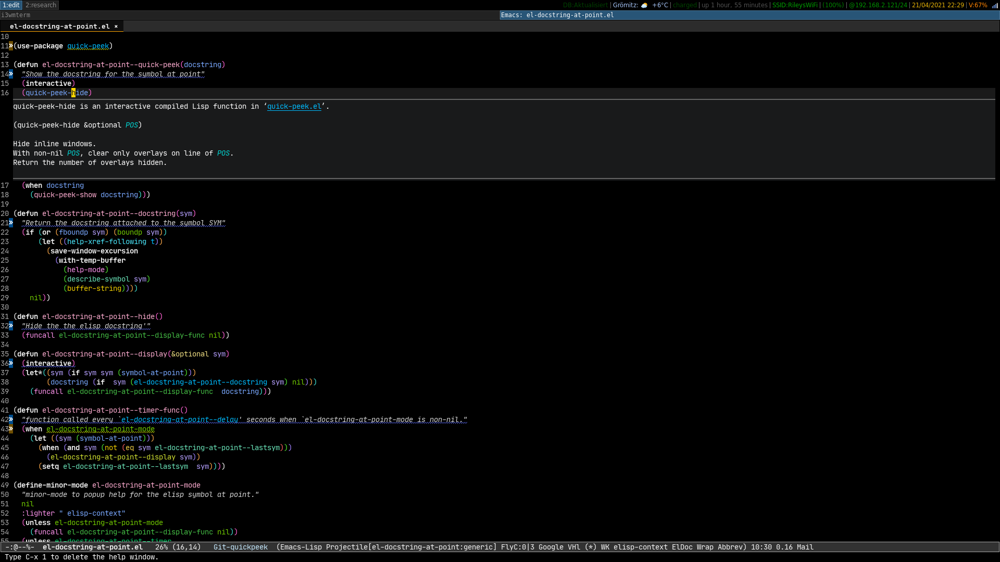

- [el-docstring-sap.el Auto display elisp docstring for symbol at point](#org053db5f)
  - [Enabling the minor mode](#org3b163df)
  - [Manually invoke `el-docstring-el--display`](#org842626d)
  - [Alternatives to `posframe` for displaying the docstring](#org51a799a)
    - [quick-peek](#org84f8a14)
    - [popup](#orge2266a2)
    - [`describe-symbol`](#org3a0cdcb)
  - [Programmatically set your display function](#orgaa2c98a)
  - [Interactively choose  the docstring display function.](#org09c1f5c)
  - [`use-package` usage example](#orga38a2d9)
  - [Customisation](#org704dee9)
    - [`el-docstring-sap--delay`](#org62bf3f7)
    - [`el-docstring-sap--display-func`](#org427e39c)
    - [`el-docstring-sap--save-history`](#org7431c19)


<a id="org053db5f"></a>

# el-docstring-sap.el Auto display elisp docstring for symbol at point

[el-docstring-sap](./el-docstring-at-point.el) defines a minor mode `el-docstring-sap-mode` which enables a "popup" displaying the elisp docstring for the symbol at point after a [configured delay](#org62bf3f7). Typically you add `el-docstring-sap-mode` to `emacs-lisp-mode-hook` to enable.

The package assumes [posframe](https://github.com/tumashu/posframe) is available and falls back to it if you set `el-docstring-sap--display-func` to something that fails.


<a id="org3b163df"></a>

## Enabling the minor mode

Typically simply add to your emacs-lisp-mode-hook.

```emacs-lisp
(add-hook 'emacs-lisp-mode-hook 'el-docstring-sap-mode)
```


<a id="org842626d"></a>

## Manually invoke `el-docstring-el--display`

Bind a key to `el-docstring-sap--display` to call regardless of mode. Note, that if `el-docstring-sap-mode` isnt on, the displayed docstring wont auto disappear when you type, instead invoke again with the cursor on whitespace to turn off the display - this is by design.

```emacs-lisp
(global-set-key (kbd "M-<f2>") #'el-docstring-sap--display)
```


<a id="org51a799a"></a>

## Alternatives to `posframe` for displaying the docstring

You need to explicitly install the libraries for `quick-peek` or `popup` if you want to use them else `el-docstring-sap--popup` or `el-docstring-sap--quick-peek` will fall back to `el-docstring-sap--posframe` after failing to load the required library.

The custom options are still there for non loaded libraries in the defcustom for `el-docstring-sap--display-func` because I can't make head nor tail of the `defcustom` info pages to figure out how to dynamically construct a list of eligible functions. Educate me!


<a id="org84f8a14"></a>

### quick-peek

<https://github.com/cpitclaudel/quick-peek>


<a id="orge2266a2"></a>

### popup

<https://github.com/kzk/elisp/blob/master/m/auto-complete/popup.el>


<a id="org3a0cdcb"></a>

### `describe-symbol`

You can set `el-docstring-sap-display-func` to `el-docstring-sap--describe-symbol` for standard help buffer viewing. See [display function customisation](#org427e39c) below.


<a id="orgaa2c98a"></a>

## Programmatically set your display function

`(setq el-docstring-sap--display-func 'el-docstring-sap--quick-peek)`

The display function accepts a non zero length string to be displayed. If nil or empty string then erase the last display. See `el-docstring-sap--display-funcs`.


<a id="org09c1f5c"></a>

## Interactively choose  the docstring display function.

`el-docstring-sap--select-display-func` sets `el-docstring-sap--display-func`. Not permanent. Bring up the custom interface to save it. (`C-h v el-docstring-sap--display-func`).


<a id="orga38a2d9"></a>

## `use-package` usage example

```emacs-lisp
(use-package el-docstring-sap
  :straight (el-docstring-sap :type git :host github :repo "rileyrg/el-docstring-sap" )
  :custom  (el-docstring-sap--display-func 'el-docstring-sap--posframe)
  :hook
  (emacs-lisp-mode . el-docstring-sap-mode)
  :bind
  ("M-<f2>" . el-docstring-sap--display)
  ("M-<f1>" . el-docstring-sap-mode))
```


<a id="org704dee9"></a>

## Customisation

Customisation group `el-docstring-sap`


<a id="org62bf3f7"></a>

### `el-docstring-sap--delay`

Delay before docstring for symbol at point


<a id="org427e39c"></a>

### `el-docstring-sap--display-func`

Function that takes a string. If nil or empty then hide previous. See `el-docstring-sap--display-funcs` for candidates.

-   `el-docstring-sap--posframe`

    -   `el-docstring-sap--posframe-poshandler`

        The poshandler that `posframe-show` uses-

    -   `el-docstring-sap--posframe-arghandler-plist`

        Customise default values for posframe display.

    -   Example screenshot

        

-   `el-docstring-sap--describe-symbol`

    -   Example screenshot

        

-   `el-docstring-sap--quick-peek`

    -   Example screenshot

        

-   `el-docstring-sap--popup`

    -   Example screenshot

        


<a id="org7431c19"></a>

### `el-docstring-sap--save-history`

**<span class="underline">Not Used currently</span>**.

When non-nil save the symbol queried to `el-docstring-sap--history`
